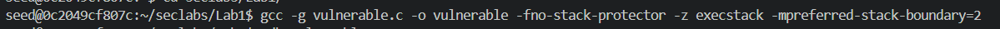
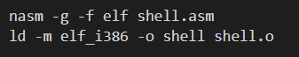
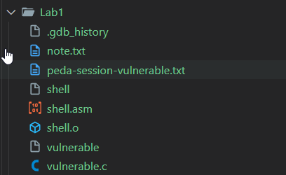
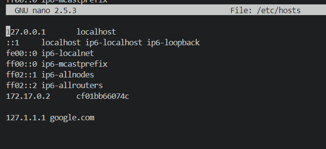

# Lab #1,21110755, Pham Van Cao, Information Security_ Nhom 02FIE
# Task 1: Task 1: Software buffer overflow attack
This lab explores various software buffer overflow attack
**Question 1**: Compile asm program and C program to executable code.
**Answer 1**:
## 1. Create Two Files: vulnerable.c and shell.asm:
*First, you need to create two files: vulnerable.c and shell.asm. These files should contain the code provided for Lab 1.:* 

vulnerable.c: This file contains the C code for the vulnerable program.
shell.asm: This file contains the assembly code for the shell program.

## 2. Compile the File:

To compile the vulnerable.c file, use the following GCC command:

 
Description: This command compiles the C source file vulnerable.c into a 32-bit executable named vulnerable. The -m32 flag specifies that the output should be a 32-bit binary, while the -g flag enables debugging information, which is useful for tools like GDB. The -fno-stack-protector option disables stack protection, allowing for a potential buffer overflow vulnerability, which is essential for certain types of exploitation in security labs. Finally, the -mpreferred-stack-boundary=2 option sets the preferred stack boundary to 2 bytes, which can be necessary for specific assembly code compatibility.

Next, compile the assembly program shell.asm using NASM and link it with ld

 
Description: The first command uses NASM (Netwide Assembler) to compile the assembly language source file shell.asm into an object file format compatible with ELF (Executable and Linkable Format) using the -f elf option. The -g flag includes debugging information in the generated object file, aiding in debugging with tools like GDB. The second command links the object file shell.o to create an executable named shell. The -m elf_i386 option specifies that the output should be an ELF binary for the 32-bit Intel architecture, ensuring proper compatibility with the compiled assembly code.

After that we have: 

## 3. Edit root mode for the shell file to attack by Environment Variable:

The purpose of the shell file is to modify the /etc/hosts file to map the IP address 127.1.1.1 to the domain name google.com.
 

After running the shell file with sudo, the /etc/hosts file has mapped the IP address 127.1.1.1 to the domain name google.com.

## 4. Decrypt the file:

## 5. **For CBC mode**:

# Task 2. Encryption Mode – ECB vs. CBC
This lab compares the behaviour of ECB and CBC encryption modes
**Question 1**: Exploration of various ECB & CBC  with openssl
**Answer 1**:
## 1. Download the bitmap file `origin.bmp`.

## 2. Split the file into header and body:

## 3. Encrypt the body using CBC mode:

## 4. Combine the header and encrypted body:
