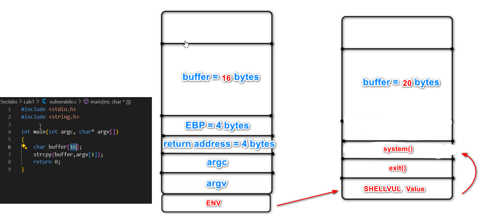
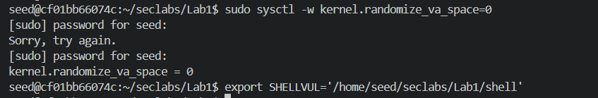

# Lab #1,21110755, Pham Van Cao, Information Security_ Nhom 02FIE
# Task 1: Task 1: Software buffer overflow attack
This lab explores various software buffer overflow attack
**Question 1**: Compile asm program and C program to executable code.
**Answer 1**:
## 1. Create Two Files: vulnerable.c and shell.asm:
*First, you need to create two files: vulnerable.c and shell.asm. These files should contain the code provided for Lab 1.:* 

vulnerable.c: This file contains the C code for the vulnerable program.
shell.asm: This file contains the assembly code for the shell program.

## 2. Compile the File:

To compile the vulnerable.c file, use the following GCC command:

 
Description: This command compiles the C source file vulnerable.c into a 32-bit executable named vulnerable. The -m32 flag specifies that the output should be a 32-bit binary, while the -g flag enables debugging information, which is useful for tools like GDB. The -fno-stack-protector option disables stack protection, allowing for a potential buffer overflow vulnerability, which is essential for certain types of exploitation in security labs. Finally, the -mpreferred-stack-boundary=2 option sets the preferred stack boundary to 2 bytes, which can be necessary for specific assembly code compatibility.

Next, compile the assembly program shell.asm using NASM and link it with ld

 
Description: The first command uses NASM (Netwide Assembler) to compile the assembly language source file shell.asm into an object file format compatible with ELF (Executable and Linkable Format) using the -f elf option. The -g flag includes debugging information in the generated object file, aiding in debugging with tools like GDB. The second command links the object file shell.o to create an executable named shell. The -m elf_i386 option specifies that the output should be an ELF binary for the 32-bit Intel architecture, ensuring proper compatibility with the compiled assembly code.

After that we have: 

## 3. Edit root mode for the shell file to attack by Environment Variable:

The purpose of the shell file is to modify the /etc/hosts file to map the IP address 127.1.1.1 to the domain name google.com.
 

After running the shell file with sudo, the /etc/hosts file has mapped the IP address 127.1.1.1 to the domain name google.com.

To allow the shell to run with root privileges, we use the following command to set the setuid permission for the shell file.

## 4. Attack Scenario:

In our C program, the stack frame of the main function is structured as shown in the diagram. Our attack scenario involves utilizing a return-to-libc attack, where we exploit the stack to redirect execution flow to the system function, which will execute the shell file specified in the environment variable SHELLVUL.

 

Use the following two commands to disable address space layout randomization (ASLR) and set the environment variable for our shell program:

sudo sysctl -w kernel.randomize_va_space=0: This command disables ASLR, which makes it easier to predict the memory addresses of functions in the program, allowing for more reliable exploitation techniques.

export SHELLVUL='/home/seed/seclabs/Lab1/shell': This command sets the environment variable SHELLVUL to the path of our shell program. This variable will be used by the system function during exploitation to execute the specified shell.

 

## 5. Find payload:

Run the program in GDB using the commands p system and p exit to find the addresses of the two functions in the libc library. Then, use the command find SHELLVUL to locate the address of the environment variable. After that, add 9 bytes to get the address of the shell file path string within the environment variable.
Next, use the command x/s 0xffffd940 to examine the string at that address. After running the command, you should see the result displayed as shown in the accompanying image.

 

Finally, we can easily create a payload buffer using the analyzed stack frame with the following:

 

## 5. Excute the result:
Finally, after running the compiled C program with the payload, we successfully executed the shell file, thereby completing the lab.

 

**Conclusion**: comment text about the screenshot or simply answered text for the question

# Task 2: Attack on the database of Vulnerable App from SQLi lab 
- Start docker container from SQLi. 
- Install sqlmap.
- Write instructions and screenshots in the answer sections. Strictly follow the below structure for your writeup. 

**Question 1**: Use sqlmap to get information about all available databases
**Answer 1**:

**Question 2**: Use sqlmap to get tables, users information
**Answer 2**:

**Question 3**: Make use of John the Ripper to disclose the password of all database users from the above exploit
**Answer 3**: